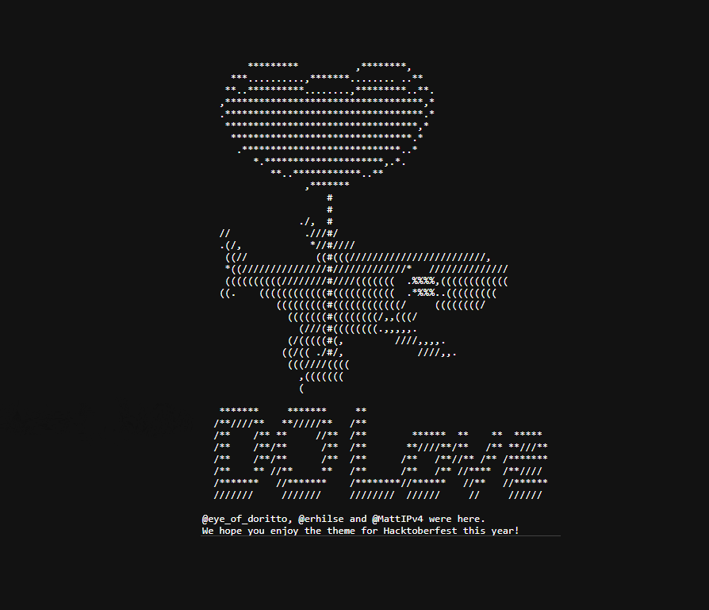

# 🧙‍♂️ Hacktober Fest 2023 `Good First` (●'◡'●)

# World of Open Sorcery Awaits! 🗺️🧙‍♂️

☄🌠 This year Makrks the 10th anniversary of Hacktoberfest, and we all can Celebrate🎉

🎯 Sign up for Hacktober, Learn and contribut towards Open Source, Fork repos make pull requests etc, and win digital swags and get a tree planted 🎄

🎆 Open Sorcery Hacktoberfest 2023: Contribute to open source, learn. Beginner-friendly. Explore issues, fork, code, and make a global impact. Let's collaborate!

🎐 Submit your first contribution to a participating project to get started with Hacktoberfest2023!

# [Register For Hacktoberfest 2023](https://hacktoberfest.com/participation/) 👈

# Task 1.0 `Initiation`
 Lets Contribute, Follow the instruction mentioned and make yourself Known.

 ##  👨‍💻INSTRUCTIONS👩‍💻

 - Fork this Repository using the button at the top on right corner.

  

 - Clone this repo to you local Machine `git clone https://github.com/Boltjazz/Hacktober23.git`

 - Carve your own path with a new branch for your modifications (ie. `git branch new-user` or simply do `git checkout -b new-user`, Check all branches `git branch` to see all branches)
  
 - Add youself by navigating to `gitfetch.js` file and scroll to line 55, copy the above code and add you Github & Linkedin user id, the api will fetch everything

  

 - If everything works Congratulations you are just 1 step away from you first Contribution

 - The 🧙‍♂️ wizard once said `If it works Don't touch it` 😐

 - Now just use either the Gui interface of `vscode` or `git teminal` for commiting changes `git add .`, `git commit -m "Hacking Wizards"`, the `git push origin ` `main or new-user`

- Create a pull request

- Wait for the request to be accepted or contact me

- Star this repository

# 🔥2023 Wizards🧙‍♂️
  

   
   
  

